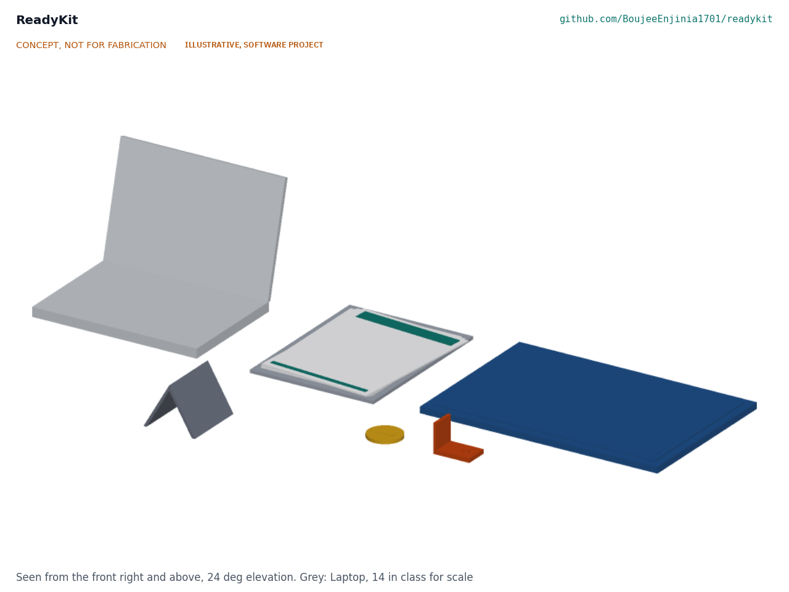
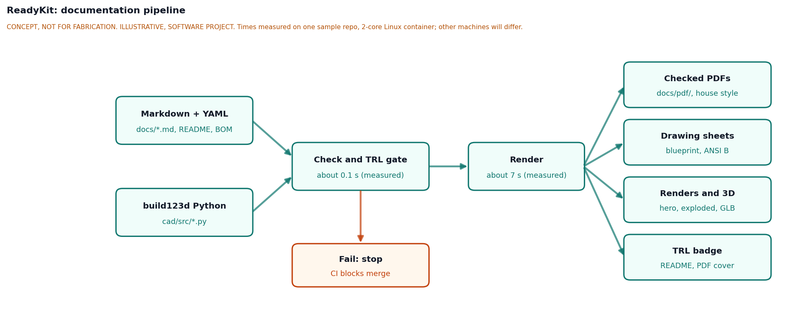

# ReadyKit design precis

## Summary

ReadyKit turns a Git repository of plain Markdown and build123d Python into checked, branded engineering documentation: controlled PDFs with revision history, drawing sheets, concept renders with a 3D viewer, and a Technology Readiness Level (TRL) that the checker will only accept when the evidence files exist. It already runs in every repository of the Design Molecule portfolio as the `.kit/` folder. The concept is to release it as a standalone open tool that any small hardware team can adopt in under 15 minutes.

Figure 1 shows an illustrative massing of the kit's outputs (`media/hero.png`), generated from the parametric model `cad/src/model.py`; ReadyKit is a software project and has nothing to fabricate. Figure 2 shows the pipeline (`media/flow.png`), and the general arrangement sheet RDK-DWG-001 (`cad/drawings/RDK-DWG-001.pdf`) lays out the same pipeline with its interfaces.

Figure 1. Illustrative massing of the kit's outputs beside a laptop for scale: document set, PDF house style bands, drawing sheet, printed massing part, TRL badge, guardrail card and template folder.

Figure 2. Pipeline from Markdown and build123d inputs through the check and TRL gate to PDFs, drawings, renders and the TRL badge. Times from RDK-CAL-001.

## How it works

1. **Author in plain text.** Each controlled document is a Markdown file that starts with YAML front matter: document ID, version, status, author, license and revision rows. Geometry lives in `cad/src/*.py` as build123d code.
2. **Check.** `render.py --check` validates every controlled document, then compares the claimed TRL in `project.yaml` with the evidence the standard requires for that level, and applies the portfolio phase cap in `PHASE.yaml`. A failure exits non-zero, so CI blocks the merge.
3. **Render.** `render.py` converts each document to a branded PDF through Python-Markdown, a Jinja2 template and WeasyPrint. The cover carries the document control table, the revision history and the project TRL.
4. **Draw and visualize.** `drawing.py` builds ANSI B sheets with title block and revision table. `concept.py` tessellates a build123d assembly, shades it with a small numpy z-buffer renderer (no GPU, no OpenGL) and writes the hero, exploded and cutaway renders, a blueprint concept sheet, a glTF model and a viewer page.
5. **Guide the agent.** `CLAUDE.md`, the phase file and four slash commands give AI coding agents the same working rules as people: TRL cap, decision rights, one step per session and a review note at the end.

## Main components

Table 1. Modules, numbered as in `bom/bom.csv`, `media/exploded.png` and drawing RDK-DWG-001.

| No. | Module | Current file | State at TRL 3 (RDK-CAL-001) |
| --- | --- | --- | --- |
| 1 | Document control checker | `.kit/render.py` | Working; 12 of 20 machine-checkable rules caught by seeded faults |
| 2 | PDF renderer and house style | `.kit/render.py`, `.kit/style/` | Working; 13 hard-coded identity strings |
| 3 | Drawing sheet generator | `.kit/drawing.py` | Working; ANSI B only |
| 4 | Concept media renderer | `.kit/concept.py` | Working; byte-identical images on repeat runs |
| 5 | TRL gate and badge | `.kit/render.py`, `PHASE.yaml` | Working for TRL 1 to 6 evidence; README badge still by hand |
| 6 | Agent guardrails | `CLAUDE.md`, `.claude/commands/` | Working; decision wording not checked |
| 7 | Template repository and CI | repo scaffold, `.github/workflows/docs.yml` | Exists per repo; not yet a published template |

## First-order numbers

Table 2. Measured figures from `docs/04-calcs/sizing.py` (RDK-CAL-001), 2-core Linux container, Python 3.11, kit 1.3.1, 2026-09-25. Ranges cover repeat runs on a shared machine.

| Quantity | Value | Basis |
| --- | --- | --- |
| Check time, this repository | 0.09 to 0.12 s, of which 80 to 100 ms is Python start-up | Measured |
| Check time, 38 finished portfolio repositories | 0.10 s median, 0.12 to 0.27 s maximum | Measured |
| Check time per added document | 0.6 to 1.0 ms; 2 s is reached at about 2,000 to 3,100 documents | Measured, 10 to 400 documents |
| PDF render | 0.6 to 1.0 s per document; 1.8 to 3.1 s for three | Measured, 5 documents, 31 pages |
| Concept media, this repository (7 parts) | 5 to 6 s | Measured |
| Concept media, 20-part model with cutaway | 12 to 23 s | Measured |
| Vendored kit folder | 1.05 MB, 94% fonts | Measured |
| Kit source | 808 lines of Python in 3 files | Counted |
| Portfolio using it | 85 project codes in the standard | Counted |
| Dependency install into a fresh environment | 32 to 47 s, 1.09 GB | Measured; WeasyPrint system libraries already present |
| Parts cost | $0 | All modules MIT; dependencies free and open source |

Check time grows linearly with document count, as the TRL 2 note assumed; the slope is small enough that start-up dominates for any real repository.

## Key design choices

Each choice below is decided by Amish, 2026-09-25: go with recommendation (RDK-DDR-001 and RDK-DDR-002). Only D5 (licensing) and D7 (evidence) are applied in the repository. D1 to D4 and D6 are features still to be built; they define requirements R10 to R12 and R16 to R18 in RDK-REQ-001, and building them is TRL 4 work, on hold by Amish's instruction.

1. **Distribution (D1).** A pip package `readykit` with a small `.kit/` stub pinned to a version, plus a GitHub template repository. Pip gives one-command upgrades (R12); the template gives a one-click start. RDK-CAL-001 found that all 38 finished repositories carry kit 1.3.1 but none has the current `STANDARDS.md`, which is the drift a versioned package prevents.
2. **Identity and branding (D2).** Organization name, website, repository owner, author and colors move into `readykit.yaml`, with Design Molecule values as the default (R11).
3. **Sheet sizes (D3).** ISO A3 (420 x 297 mm) is to be added beside ANSI B (431.8 x 279.4 mm) (R17). The parametric model already takes the sheet size as a parameter; the kit's sheet generator change is on hold with the rest of the build.
4. **Command-line interface (D4).** One `readykit` command with `init`, `check`, `render`, `media` and `upgrade`, keeping the scripts as thin wrappers so existing repositories keep working (R18).
5. **Licensing of the tool (D5).** The portfolio license pair, as on every other repo: hardware and non-code content (documents, drawings, CAD, BOM and media) under CERN-OHL-S v2 (`LICENSE`) and software under MIT (`LICENSE-SOFTWARE`). The separate content license adopted under D5 on 2026-09-25 was reversed by Amish on 2026-09-26 for consistency across the portfolio (RDK-DDR-002); every controlled document and drawing title block carries CERN-OHL-S-2.0 again.
6. **Relationship to existing standards (D6).** Export an Open Know-How 1.0 manifest (`okh.yml`) from the same metadata (R16). Three of its five required fields (title, description, license) already exist in `project.yaml`; the manifest author and the project link come from `readykit.yaml`. A DIN SPEC 3105 checklist is not adopted.
7. **TRL 3 evidence for a software project (D7).** The parametric model exports the illustrative massing as STEP and STL, the general arrangement sheet shows the pipeline layout, and the calculation note measures speed and coverage. This keeps the standard's evidence rule unchanged for software.

## Safety

ReadyKit is software and has no physical hazards of its own. Two risks matter:

> **Safety:** A passing check means the documents are complete and consistent with the standard. It does not mean the design is safe, correct or fit for use. Every rendered PDF and drawing must keep the "Draft" or "Not for fabrication" marking until a qualified person has reviewed the engineering.

> **Safety:** The checker must never drop the requirement for a safety section in documents that describe mains voltage, heat, pressure, lithium cells, moving machinery or chemicals. Automating that check (Table 4 of RDK-REQ-001) should add a flag, never remove the human review.

## Open questions

- [x] Name: keep "ReadyKit"; recheck the package index just before the first release and publish the first real release under that name as soon as the package installs. The GitHub repository already exists. Decided by Amish, 2026-10-02 (O1, RDK-DEC-001).
- [ ] Pilot users: an open science hardware group, with GOSH (Gathering for Open Science Hardware) as the first candidate to approach, recruiting two or three member projects through its community forum; a university lab as the second pilot. Decided by Amish, 2026-10-02 (O2, RDK-DEC-001).
- [x] Windows: WSL2 for the first release; native Windows later if pilot users ask for it. Decided by Amish, 2026-10-02 (O3, RDK-DEC-001).
- [x] Decision-wording check (R13): generic, with each repository's "still open" phrase set in its identity file, defaulting to "Proposed, awaiting". Decided by Amish, 2026-10-02 (O4, RDK-DEC-001).
- [x] Scope of the first package: release gate and archive helper in the release extra, build plan pictures in the media extra; photoreal renders and storefront cards kept for the portfolio only. Python 3.11 or later, tested in CI on 3.11 and the newest release. Decided by Amish, 2026-10-02 (RDK-DDR-003, A1 and A2; RDK-DEC-001).
