# ReadyKit prototype build plan

**Plan, not yet built.** How to build the first proof-of-concept prototype, component by component. Building and testing to it is TRL 4 work. Decisions still to be made are kept in the design decisions register ([docs/06-design-decisions.md](06-design-decisions.md)), not here.

## 1. What you are building

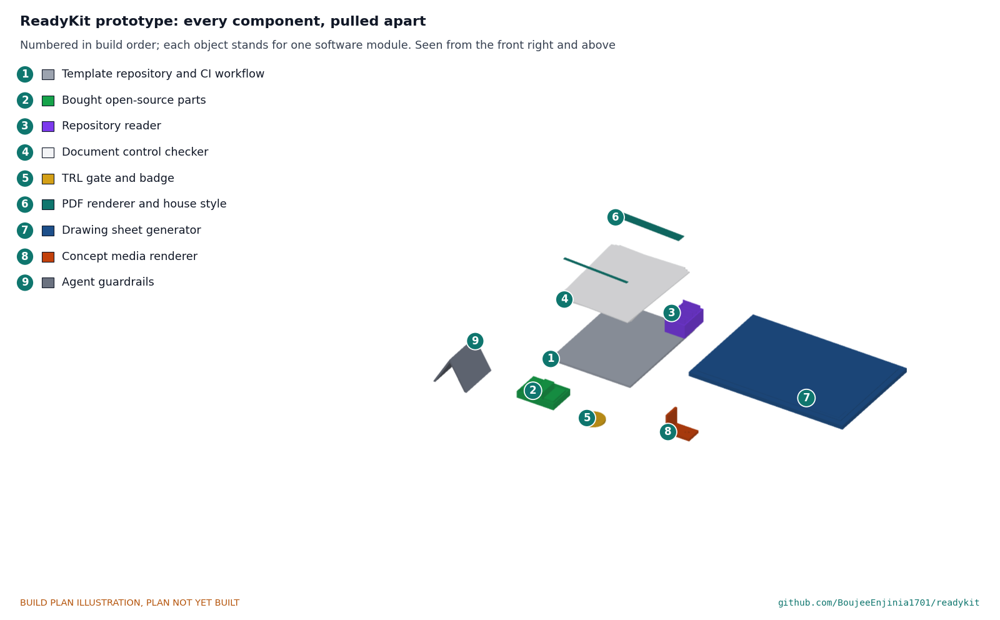

*Figure 1. Every component pulled apart and numbered in build order. ReadyKit is software, so each object stands for one module: the folder for the template repository, the paper stack for the checker, the badge for the readiness gate, and so on.*

The prototype is the first standalone ReadyKit: an installable Python package and a template repository that together check, render and draw a hardware project's documents, built from the kit that already runs inside every repository of this portfolio. Figure 1 shows its nine components in the order you make or fit them. Eight are made by writing or moving code: the template repository with its CI workflow, the repository reader, the document control checker, the readiness gate and badge, the PDF renderer, the drawing sheet generator, the concept media renderer and the agent guardrails. One is bought, free: the open-source libraries, fonts and 3D viewer script the modules stand on. Most of the code exists today and is moved, not rewritten; the new work is the reader, the identity settings, the second sheet size, the added checks and the single command. The parts cost is USD 0 from the bill of materials.

> **Safety:** ReadyKit has no physical hazards of its own. Its risk is false confidence: a passing check means the documents are complete and consistent, not that a design is safe or fit for use. Every PDF and drawing keeps its "Draft" or "not for fabrication" marking until a qualified person has reviewed the engineering, and no check added in this build may ever remove the human review of hazards.

## 2. What changed to make it buildable

The concept described what the kit does; five of its joints were missing or could not work as described, and the illustration needed two more objects. Each change keeps what ReadyKit does, and all of them are recorded in decision record RDK-DDR-003, open for Amish's review.

*Table 1. Changes from the concept.*

| Component | The concept had | The buildable design has | Why |
| --- | --- | --- | --- |
| Repository reader (new) | No module given the job of reading the repository; the project file is read in eight places, three different ways | One reader that loads the project file, identity file, phase file, document headers and parts list once and hands every module one record (Figure 4) | One joint instead of eight; the identity values have one place to be read |
| Template repository and agent guardrails | A "small stub" in each repository, contents undefined; agent rules inside the package, where no agent would read them | A stub of about 47 kB: version pin, identity file, agent rules and commands, a copy of the standard. Code and fonts stay in the package (Figure 3) | Agents read their rules from the repository they work in |
| Bought libraries | One install of about 1.1 GB for everything, even the check | A core of three small libraries, about 5 MB, enough for the check; extras for PDFs, drawings, media and releases (Figure 2) | Faster first install and faster CI checks |
| Concept media renderer | Viewer page loads its 3D viewer script from the internet | A pinned copy of the script beside the 3D model (Figure 15) | The viewer works offline, like everything else |
| Readiness gate | Readiness level on the PDF cover; the README badge typed by hand | The gate writes both from the one value it has checked (Figure 9) | The badge can no longer disagree with the project file |
| Illustration | Paper stack hanging over the folder; no object for the reader or the bought parts | Stack lies inside the folder; a card index box for the reader and a tray for the bought parts | Every component has an object, and every object sits as drawn |

## 3. Making the components

Make and check each component before the step that needs it. For software, each making sketch shows what the module reads, the parts inside it and what it hands on, in place of three views; the inset shows its object in the kit. "Moving" a module means taking its present code, cutting it loose from the files it reads directly, and pointing it at the repository reader instead. Times are on an ordinary two-core laptop or a free CI runner.

### 3.1 Template repository and CI workflow

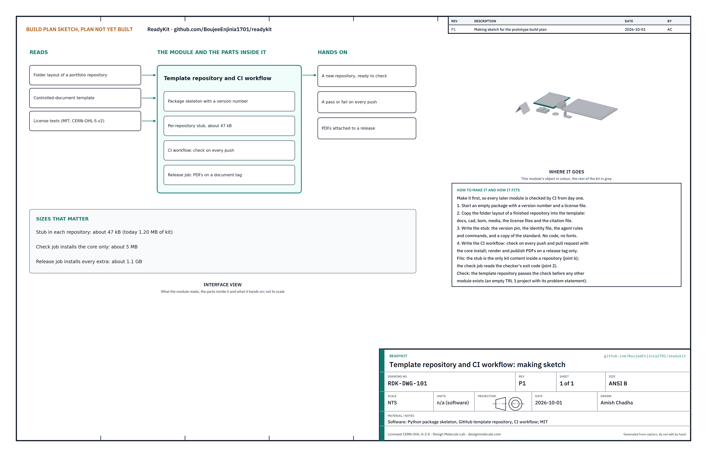

*Figure 2. Template repository and CI workflow making sketch (RDK-DWG-101).*

**What it is and what it is made from.** The package skeleton every module goes into, the template repository a new team copies, and the CI workflow that checks every push. A Python package with a version number, a GitHub template repository and a GitHub Actions workflow, all under MIT.

**How to make it.**

1. Start an empty package with a version number, a license file and the four optional extras named in Table 1 (PDF, drawings, media, release), each listing its libraries.
2. Copy the folder layout of a finished portfolio repository into the template: documents, CAD, parts list and media folders, both license files and the citation file. Leave out every project-specific file.
3. Write the stub that setup will put into each repository: the version pin, an identity file filled with the Design Molecule values, the agent rules and session commands, and a copy of the standard. It holds no code and no fonts and comes to about 47 kB.
4. Write the CI workflow: on every push and every pull request, install the core only and run the check; on a release tag, install every extra, render the PDFs and attach them to the release.

**How it fits the parts next to it.**

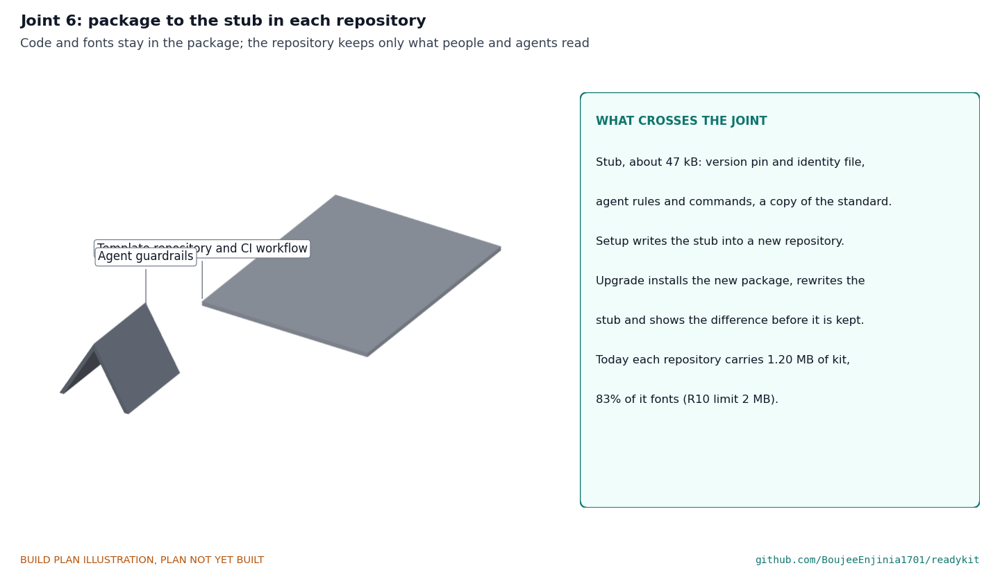

*Figure 3. Code and fonts stay in the package; the repository keeps only what people and agents read.*

The stub is the only part of the kit that lives inside a project repository. The CI workflow never looks inside the check: it acts on its exit code alone (Figure 7).

**Check before moving on.** A new repository made from the template, holding only a problem statement and a project file at readiness level 1, passes the CI check with the core install.

### 3.2 Bought open-source parts

Buy to specification, not brand; every item is free. Line numbers are those of the bill of materials.

- **Core libraries (line 10).** A YAML reader, a Markdown converter and a template engine; about 5 MB installed. Enough for the check and the gate.
- **Extras (line 10).** PDF: a web-page-to-PDF converter. Drawings: an SVG converter and the build123d CAD library. Media: build123d, a numerical library, a plotting library and an image library. Release: the REUSE tool and a citation-file validator. About 1.1 GB with every extra.
- **System libraries for PDF output (line 11).** Pango and fontconfig, from the operating system's package manager; needed only with the PDF extra.
- **Fonts (line 8).** IBM Plex Sans and Mono under the SIL Open Font License, shipped inside the package.
- **3D viewer script (line 13).** A pinned version of the model-viewer web component under Apache-2.0, with its license notice.
- **CI hosting (line 9).** GitHub Actions, free for public repositories.

Check each license against the audit in the calculation note before adding it; nothing under a license that forbids redistribution goes in.

### 3.3 Repository reader

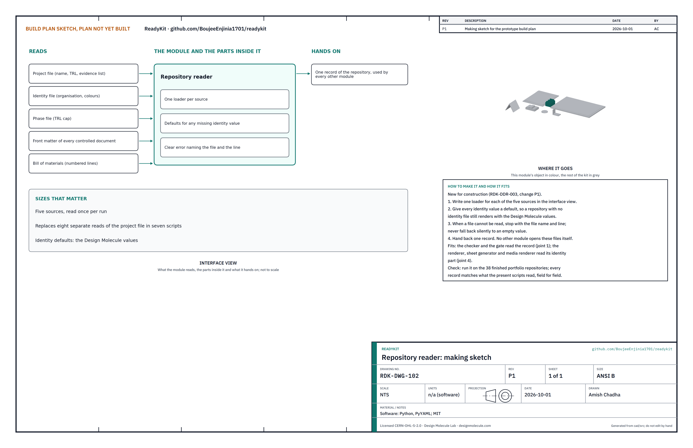

*Figure 4. Repository reader making sketch (RDK-DWG-102).*

**What it is and what it is made from.** New. The one module that opens the repository's settings and document headers; every other module gets what it needs from the reader's record. Python with the core YAML library.

**How to make it.**

1. Write one loader for each of the five sources: the project file, the identity file, the phase file, the header block of every controlled document, and the parts list.
2. Give every identity value (organisation, website, repository owner, author, colours) a default, so a repository with no identity file still renders with the Design Molecule values.
3. When a file cannot be read, stop with the file name and line number. Never fall back silently to an empty value.
4. Hand back one record. Take the repository address from the project file's repository line, never from a name written into the code.

**How it fits the parts next to it.**

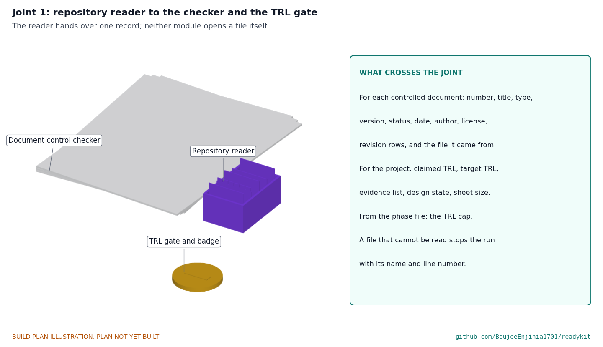

*Figure 5. The reader hands over one record; neither module opens a file itself.*

The checker and the gate read the document and project parts of the record (Figure 5). The PDF renderer, sheet generator and media renderer read its identity part (Figure 11).

**Check before moving on.** Run the reader on the 38 finished portfolio repositories: every field of every record matches what the present scripts read, and the repository address is the same for all of them.

### 3.4 Document control checker

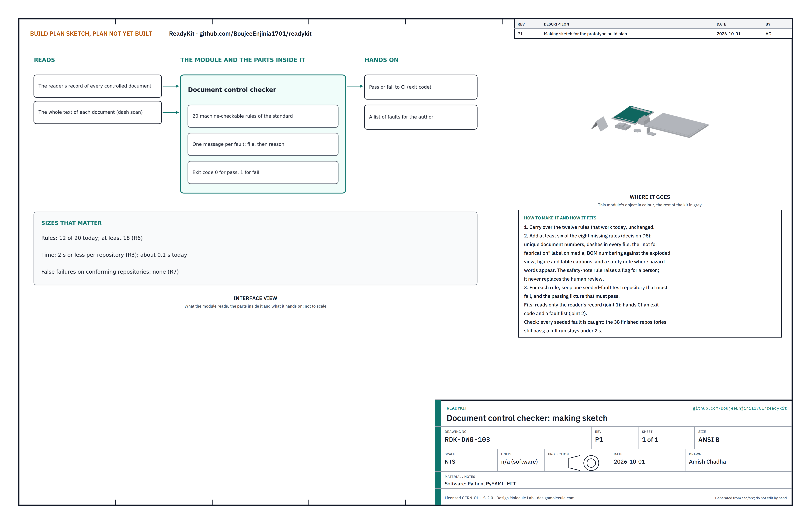

*Figure 6. Document control checker making sketch (RDK-DWG-103).*

**What it is and what it is made from.** The module that tests every controlled document against the standard and fails the run when one breaks a rule. Python, core libraries only.

**How to make it.**

1. Move the twelve rules that work today, unchanged, onto the reader's record.
2. Add at least six of the eight missing rules: unique document numbers, no long dashes in any file, the "not for fabrication" label on concept media, parts-list numbering against the exploded view, figure and table captions, and a safety note wherever hazard words appear. The safety-note rule raises a flag for a person to review; it never passes or replaces that review.
3. For each rule, keep one small test repository with that one fault planted in it, which must fail, and one passing repository, which must pass.
4. Print one line per fault, file first, then the reason; exit with 0 when every rule passes and 1 otherwise.

**How it fits the parts next to it.**

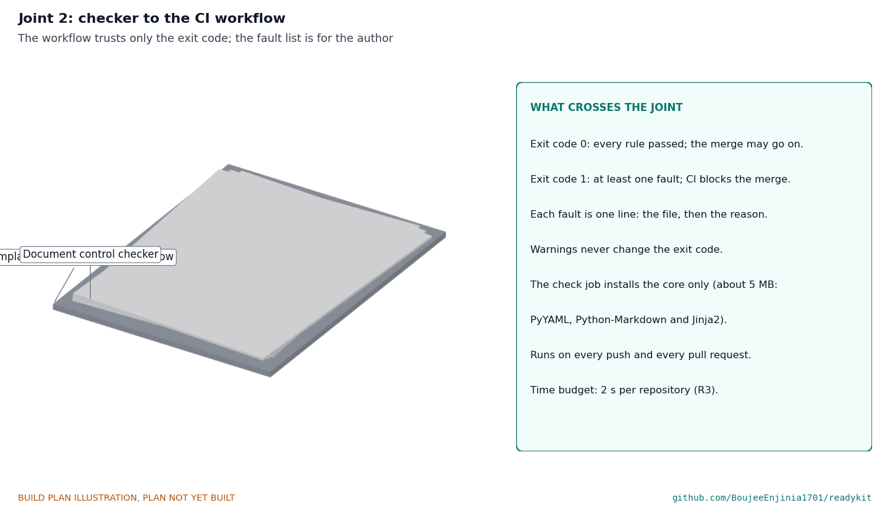

*Figure 7. The workflow trusts only the exit code; the fault list is for the author.*

The checker reads only the reader's record (Figure 5). Warnings never change the exit code.

**Check before moving on.** Every planted fault is caught; the 38 finished repositories still pass; a full run takes under 2 s.

### 3.5 Readiness gate and badge

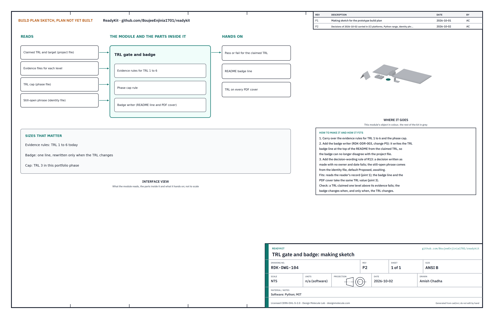

*Figure 8. Readiness gate and badge making sketch (RDK-DWG-104).*

**What it is and what it is made from.** The module that accepts a claimed technology readiness level only when the evidence files for it are present and the level is within the portfolio cap, then writes that level where people see it. Python.

**How to make it.**

1. Move the evidence rules for levels 1 to 6 and the cap rule onto the reader's record.
2. Add the badge writer: when the gate passes, it replaces the single badge line under the README title with one built from the claimed level. It touches no other line.
3. Add the decision-wording rule of requirement R13: a decision written as made, with no owner and date, fails. The rule is generic; each repository's "still open" phrase comes from its identity file, defaulting to "Proposed, awaiting".

**How it fits the parts next to it.**

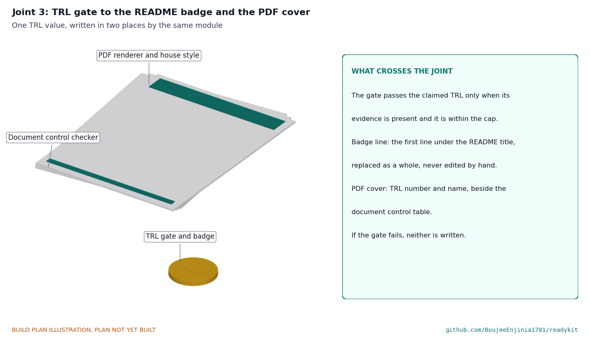

*Figure 9. One readiness value, written in two places by the same module.*

The PDF renderer takes the level for each cover from the gate, never from the project file directly. If the gate fails, neither the badge nor any cover is written.

**Check before moving on.** A level claimed one step above its evidence fails; the badge line changes when, and only when, the level changes.

### 3.6 PDF renderer and house style

*Figure 10. PDF renderer and house style making sketch (RDK-DWG-105).*

**What it is and what it is made from.** The module that turns each controlled document into a branded PDF with its cover, document control table and revision history. Python with the Markdown converter, the template engine, the PDF converter and the bundled fonts.

**How to make it.**

1. Take every organisation name, website, owner, author and colour out of the page template and style sheet; there are 13 such strings today. Fill them from the reader's identity record instead.
2. Load the fonts from inside the package.
3. Render only after a passing check. A failing check renders nothing.
4. Keep one PDF per document and version; remove older versions from the output folder (they stay in the history and in releases).

**How it fits the parts next to it.**

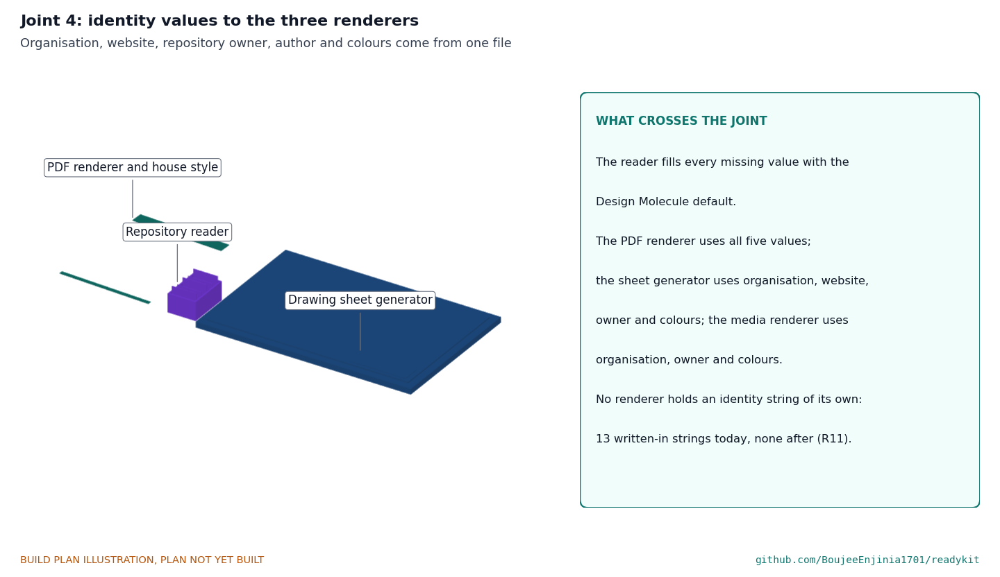

*Figure 11. Organisation, website, repository owner, author and colours come from one place.*

The page is US Letter, 216 x 279 mm, with 20 mm margins. The readiness level on the cover comes from the gate (Figure 9).

**Check before moving on.** Render one repository with the default identity and again with a second, made-up identity: the second set of PDFs contains no Design Molecule text.

### 3.7 Drawing sheet generator

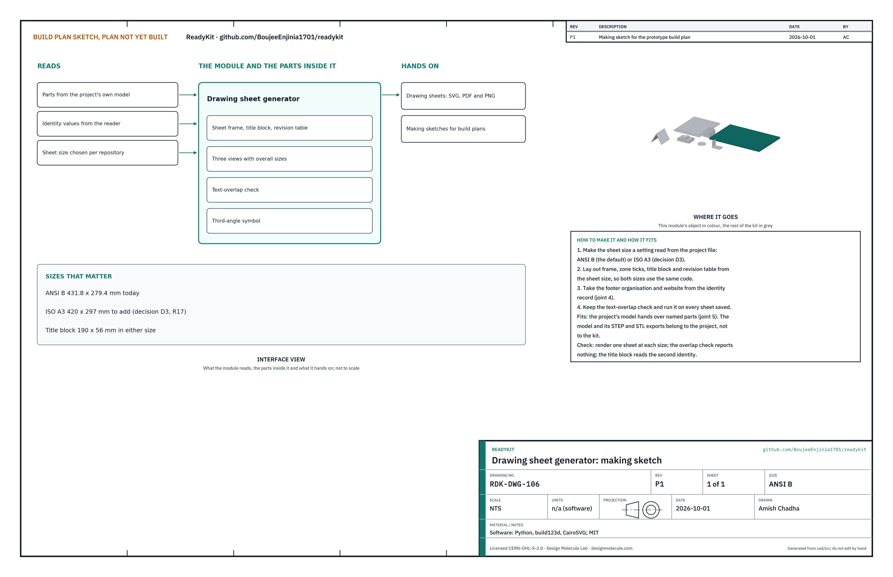

*Figure 12. Drawing sheet generator making sketch (RDK-DWG-106).*

**What it is and what it is made from.** The module that lays out drawing sheets: frame, title block, revision table, views with overall sizes, and the text-overlap check. Python with the CAD library and the SVG converter.

**How to make it.**

1. Make the sheet size a setting in the project file: ANSI B, 431.8 x 279.4 mm (the default), or ISO A3, 420 x 297 mm.
2. Work out the frame, zone ticks, title block (190 x 56 mm in either size) and revision table from the sheet size, so one piece of code serves both.
3. Take the footer organisation and website from the reader's identity record.
4. Keep the text-overlap check and run it on every sheet saved.

**How it fits the parts next to it.**

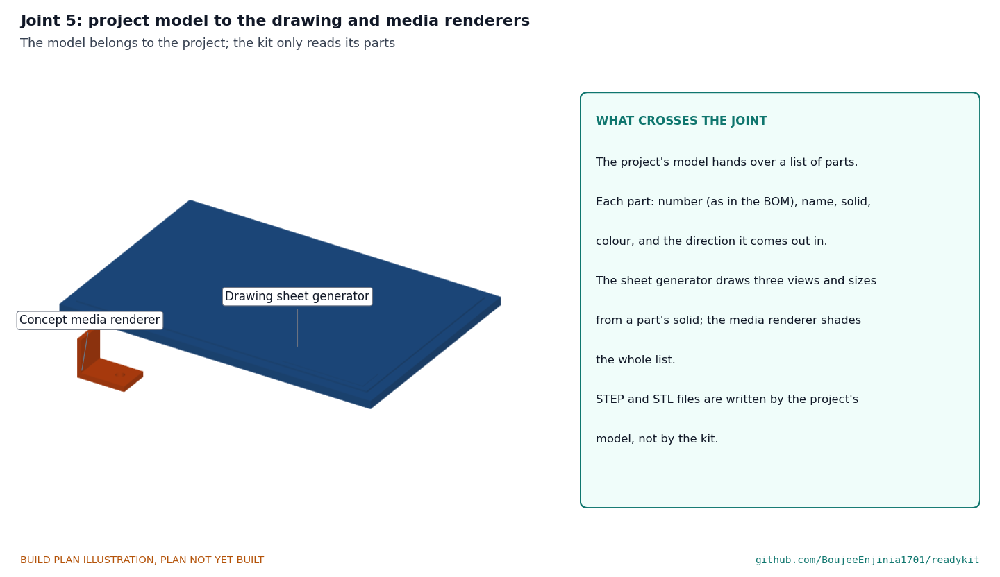

*Figure 13. The model belongs to the project; the kit only reads its parts.*

The project's own model hands over a list of parts, each with its parts-list number, name, solid, colour and the direction it comes out in. The model and its STEP and STL exports belong to the project, not to the kit.

**Check before moving on.** One sheet at each size; the overlap check reports nothing; the title block shows the second identity when that identity is set.

### 3.8 Concept media renderer

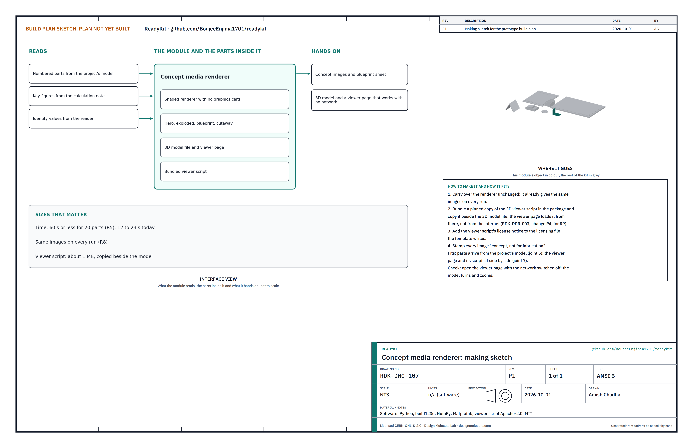

*Figure 14. Concept media renderer making sketch (RDK-DWG-107).*

**What it is and what it is made from.** The module that shades the project's model into the hero, exploded, cutaway and blueprint images and writes the 3D model and its viewer page, with no graphics card. Python with the CAD, numerical and plotting libraries, and the bought viewer script.

**How to make it.**

1. Move the renderer unchanged; it already gives the same images on every run.
2. Copy the pinned viewer script beside the 3D model each time the media are written, and point the viewer page at that copy.
3. Add the viewer script's license notice to the licensing file the template writes.
4. Keep the "concept, not for fabrication" stamp on every image.

**How it fits the parts next to it.**

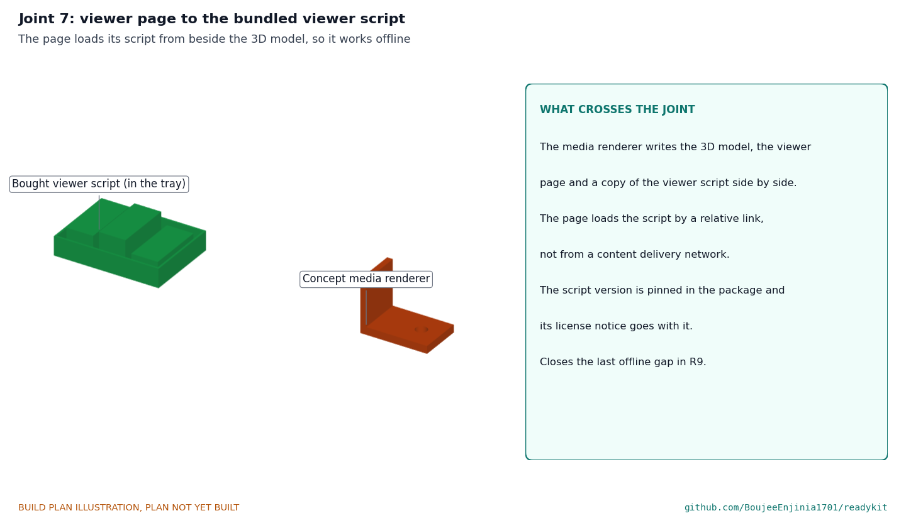

*Figure 15. The page loads its script from beside the 3D model, so it works offline.*

Parts arrive from the project's model exactly as for the drawing generator (Figure 13).

**Check before moving on.** With the network switched off, open the viewer page: the model loads, turns and zooms. A 20-part model renders in under 60 s.

### 3.9 Agent guardrails

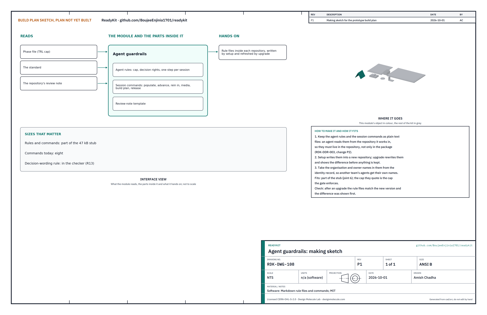

*Figure 16. Agent guardrails making sketch (RDK-DWG-108).*

**What it is and what it is made from.** The plain-text rules and session commands that give AI coding agents the same working rules as people: the readiness cap, decision rights, one step per session and a review note at the end. Markdown files, MIT.

**How to make it.**

1. Keep the rules and the eight session commands as plain text files.
2. Take the organisation and owner names in them from the reader's identity record, so another team's agents see that team's names.
3. Make setup write them into a new repository, and make upgrade rewrite them, show the difference and keep nothing until it is accepted.

**How it fits the parts next to it.** They travel in the stub (Figure 3). The cap they quote is the cap the gate enforces, read from the same phase file.

**Check before moving on.** After an upgrade, the rule files match the new version and the difference was shown before it was kept.

## 4. Putting it together

In each picture the components already fitted are grey and the one being fitted is in colour, with an arrow showing the way it goes in. For software, "fitting" a module means adding it to the package, giving it its subcommand on the single command (setup, check, render, media, upgrade), and adding its test repositories to CI.

### Step 1: template repository and CI workflow

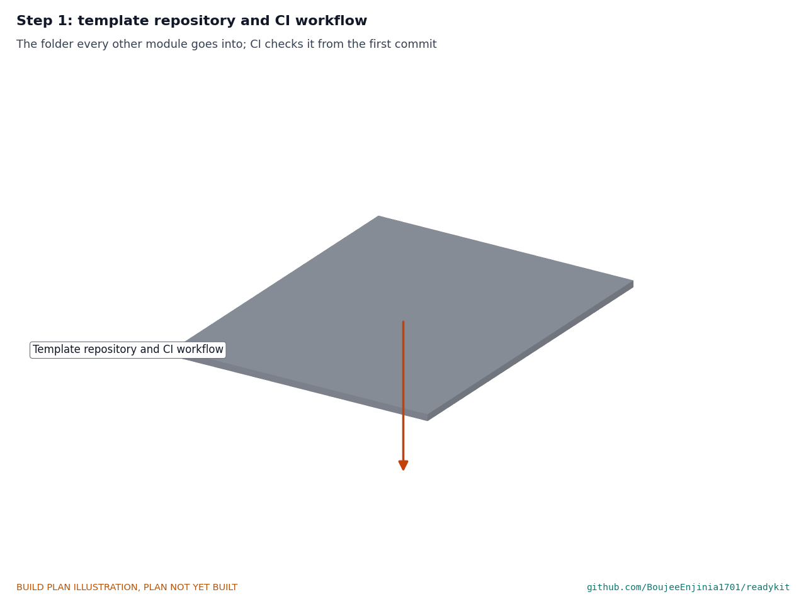

Publish the package skeleton and the template as a private test repository first. **Hold point:** the template passes the CI check (section 3.1) before any module is added.

### Step 2: bought open-source parts

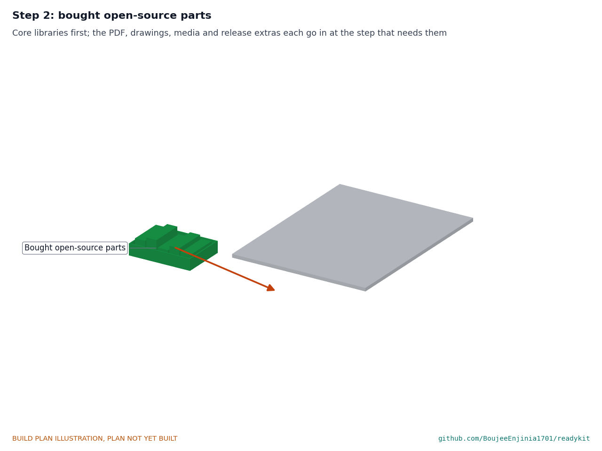

Add the core libraries to the package now. Add each extra at the step that first needs it: PDF at step 6, drawings at step 7, media at step 8, release when the release gate is added.

### Step 3: repository reader

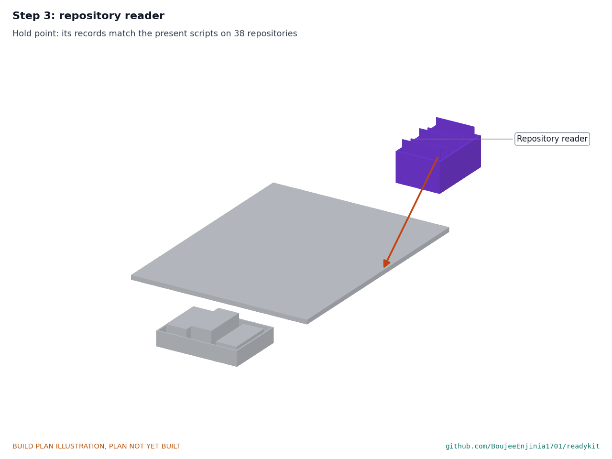

Add the reader. **Hold point:** its records match the present scripts on all 38 repositories (section 3.3).

### Step 4: document control checker

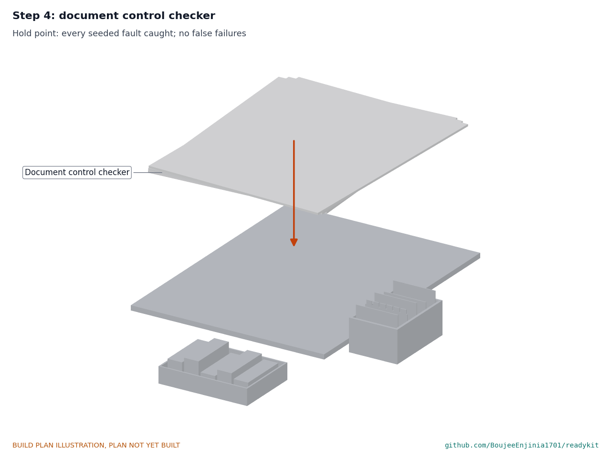

Give it the check subcommand and add its planted-fault repositories to CI. **Hold point:** every planted fault caught, no failure on a conforming repository.

### Step 5: readiness gate and badge

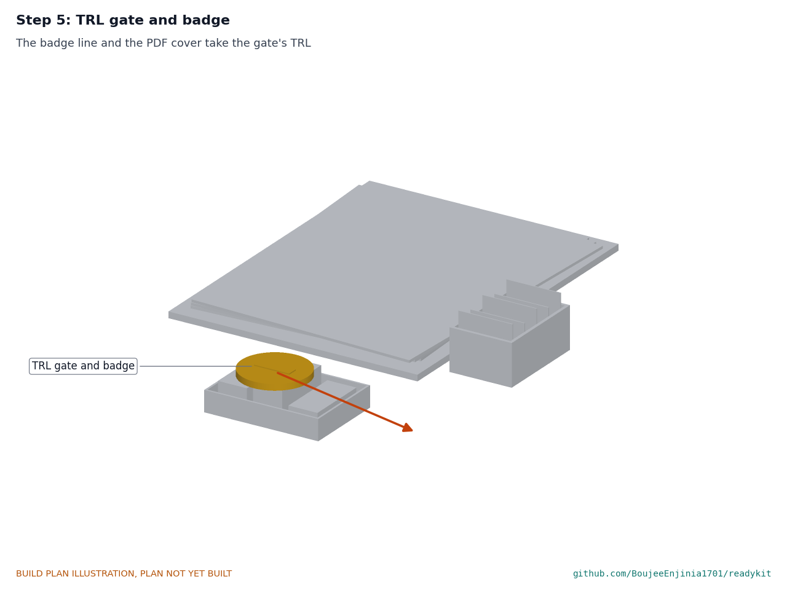

Runs inside the check subcommand, after the document rules. The badge writer runs only on a passing check.

### Step 6: PDF renderer and house style

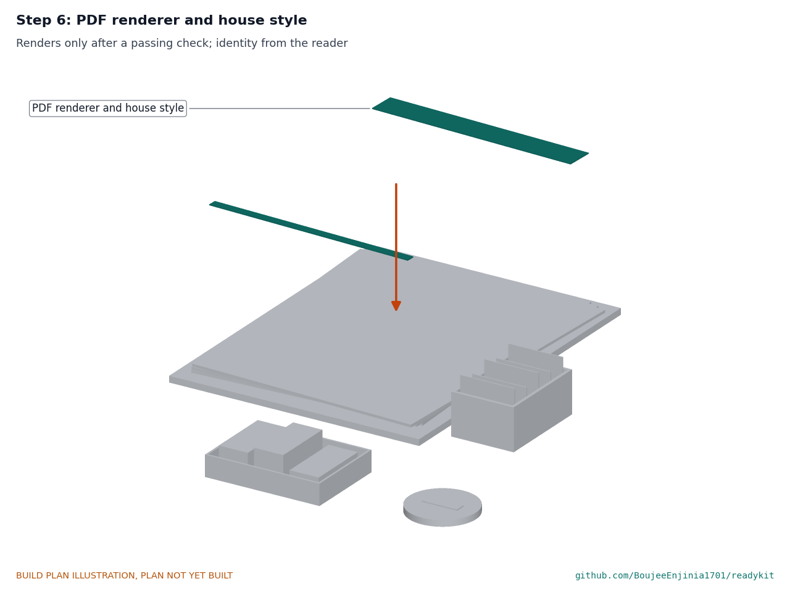

Give it the render subcommand. Install Pango and fontconfig on the CI runner and on the test machine first.

### Step 7: drawing sheet generator

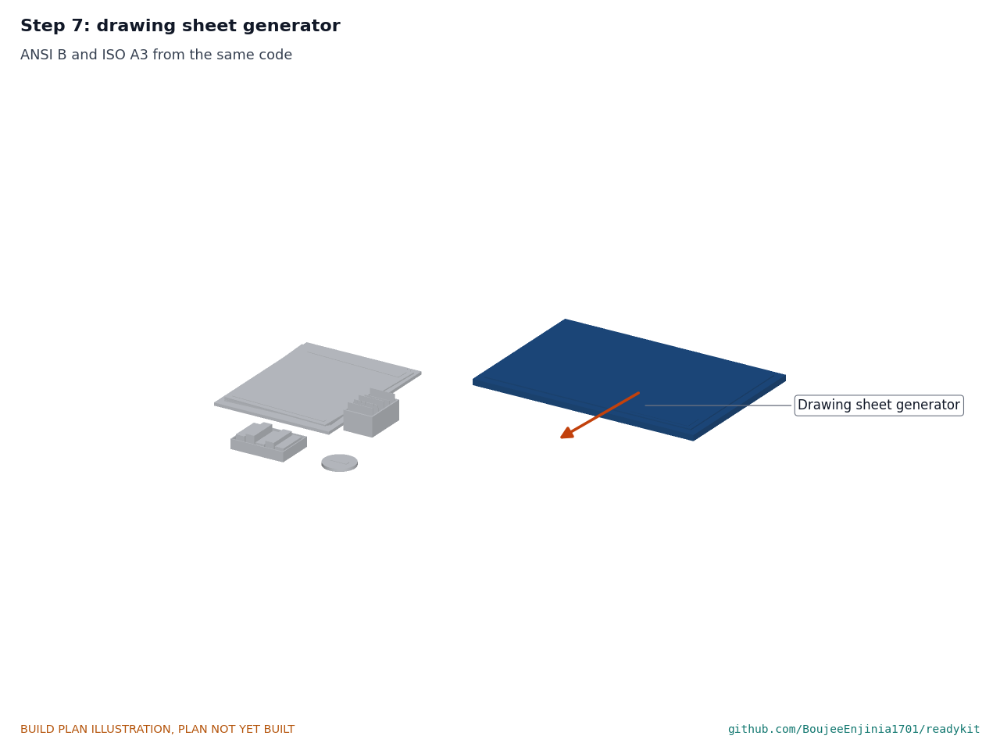

Called by the project's own sheet script, as today; render one test sheet at each size.

### Step 8: concept media renderer

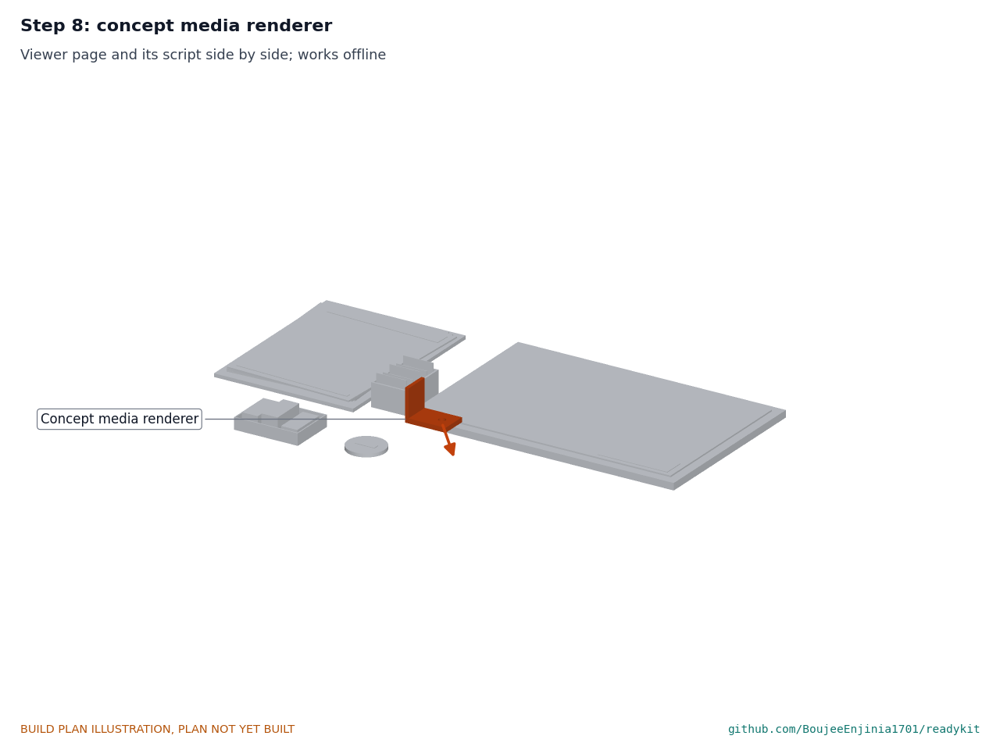

Give it the media subcommand. The bought viewer script goes in with it.

### Step 9: agent guardrails

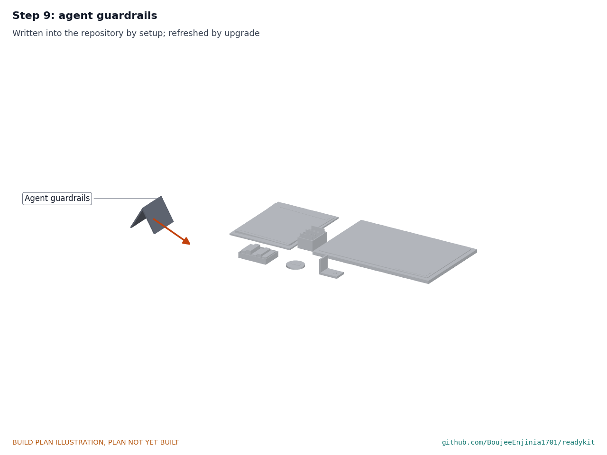

Add the rule files to the stub. Give the setup and upgrade subcommands their final form now that every module is in.

### Step 10: first run on a fresh machine

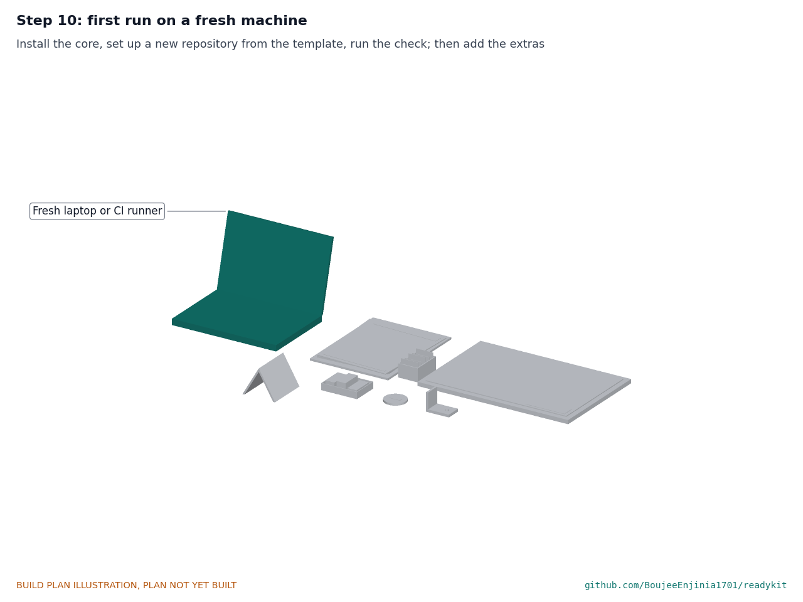

On a laptop that has never had the kit, and on a fresh CI runner: install the core, make a new repository from the template, run the check, then add the extras and render. **Hold point:** safety stop S4 in section 6 before any outside team is asked to try it.

## 5. First checks

These are the checks a TRL 4 test report would record; this plan only lists them. Requirement numbers are those of RDK-REQ-001.

*Table 2. First checks.*

| Check | Requirement | How | Pass when |
| --- | --- | --- | --- |
| Setup time | R1 | A person new to the kit, on a clean Linux or macOS machine with Python, from an empty folder | First passing check in 15 min or less |
| Platforms | R2 | CI on Linux, macOS and Windows through the Linux subsystem (WSL2) | Check and render pass on all three |
| Check time | R3 | Time the check on this repository and on the largest portfolio repository | 2 s or less |
| PDF time | R4 | Render three documents | 10 s or less |
| Media time | R5 | Render a 20-part model with cutaway and exploded views, no graphics card | 60 s or less |
| Coverage | R6 | One planted fault per machine-checkable rule | At least 18 of 20 caught |
| False failures | R7 | Check the 38 finished repositories and one written by an outside team | No failures |
| Same output twice | R8 | Render twice and compare | Same PDF text and identical images, apart from date and commit |
| Offline | R9 | Network switched off: check, render, media, then open the viewer page | All work; the model loads in the viewer |
| Footprint | R10 | Measure the stub in a new repository | 2 MB or less (about 47 kB expected) |
| Identity | R11 | Render with a second identity | No Design Molecule text anywhere in the output |
| Upgrade | R12 | Upgrade five repositories by one version | Each updated, difference shown first |
| Guardrails | R13 | Planted test documents: level above the cap, work beyond the cap, a decision written as made with no owner | All three fail |
| Cost | R14 | Re-run the license audit with every extra | Every dependency free and open source |
| Guide | R15 | A new user follows the getting-started guide | Guide of 5 pages or fewer; user reaches a passing check |
| Open Know-How export | R16 | Export this repository's manifest and validate it against the standard | Valid, every required field filled |
| Sheet sizes | R17 | One sheet in each size | ANSI B and ISO A3 both correct |
| One command | R18 | Run setup, check, render, media and upgrade; then the old scripts | All work |

## 6. Safety stops

Stop at each point. Carry on only when everything listed is true.

- **S1. Before the checker's rules change.** The passing test repository still passes, every planted fault is still caught, and the 38 finished repositories still pass. The hazard-word rule only adds a flag for a person; no rule removes or downgrades a safety-section requirement.
- **S2. Before upgrade writes into any repository.** The difference has been shown and accepted, and the repository has a clean commit to return to.
- **S3. Before the kit is run on a repository you do not own.** Work on a copy, as the calculation note did; never push to someone else's repository.
- **S4. Before anything is published.** Publishing the package, making the template repository public or tagging a release is the owner's decision; prepare it and stop. Every rendered document and drawing still carries its "Draft" or "not for fabrication" marking.
- **S5. Before a document is rendered as Released.** A qualified person has reviewed the engineering in it. A passing check is never that review.

## 7. Tools, skills and workspace

**Tools.** A laptop with Python 3, Git and a text editor; a GitHub account with Actions enabled; Pango and fontconfig from the system package manager; access to a macOS and a Windows machine, or CI runners for them, for the platform checks.

**Skills.** Python packaging and testing, YAML, Markdown, Git and GitHub Actions. No engineering trade skill is needed to build the kit, but a person with engineering review experience should set the hazard-word list of the safety-note rule.

**Workspace.** One private test repository made from the template, one copy of the 38 finished portfolio repositories to check against, and a folder of planted-fault test repositories, one per rule. Nothing physical is built.

## 8. Where the numbers come from

- Model and illustration checks: `cad/src/model.py` (`python cad/src/model.py --check`); STEP and STL exports in `cad/step/` and `cad/stl/`.
- Pictures: `cad/src/build_plan_media.py`, using `.kit/build_views.py`; written to `docs/05-build-plan/` and `cad/drawings/RDK-DWG-101` to `RDK-DWG-108`.
- General arrangement: `cad/drawings/RDK-DWG-001.pdf`, Rev P4.
- Calculations: `docs/04-calcs/01-sizing.md` (RDK-CAL-001 v0.3) and `docs/04-calcs/sizing.py`: check, PDF and media times, rule coverage, kit size and the license audit.
- Bill of materials: `bom/bom.csv` and `bom/bom-notes.md`.
- Decisions: `docs/decisions/0003-design-for-construction.md` (RDK-DDR-003), with RDK-DDR-001 and RDK-DDR-002.
- Requirements: `docs/03-requirements.md` (RDK-REQ-001 v0.5).
- Names used in this plan: the project file is `project.yaml`; the identity file is `readykit.yaml`; the phase file is `PHASE.yaml`; the standard is `STANDARDS.md`; the agent rules are `CLAUDE.md` with the commands in `.claude/commands/`; the present kit code is in `.kit/` (`render.py`, `drawing.py`, `concept.py`); the CI workflow is `.github/workflows/docs.yml`.
